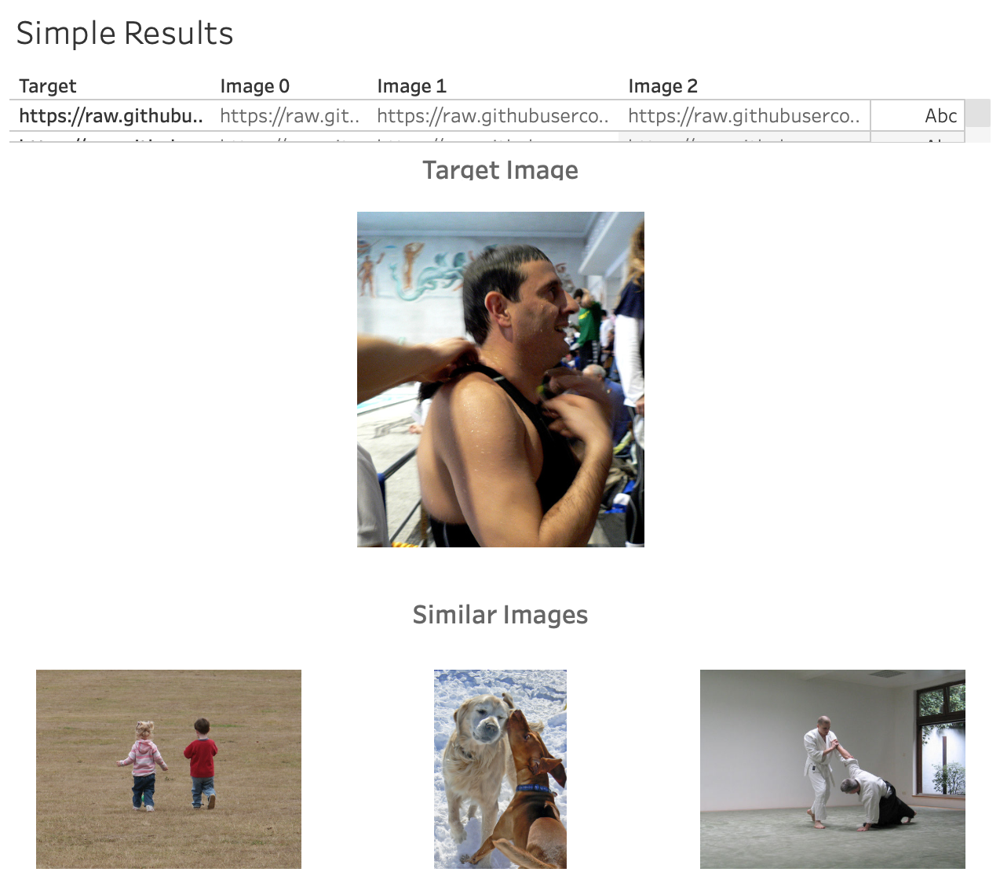
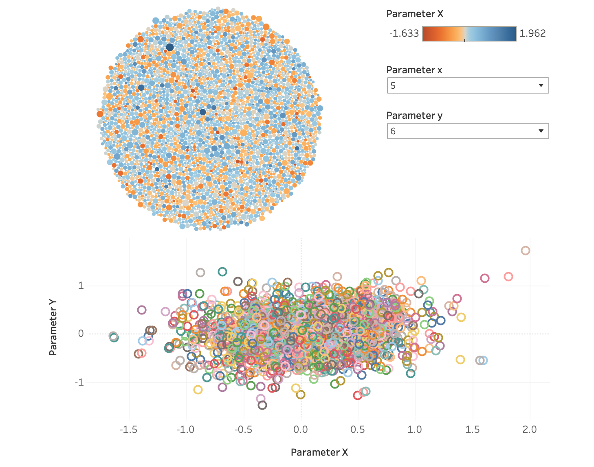
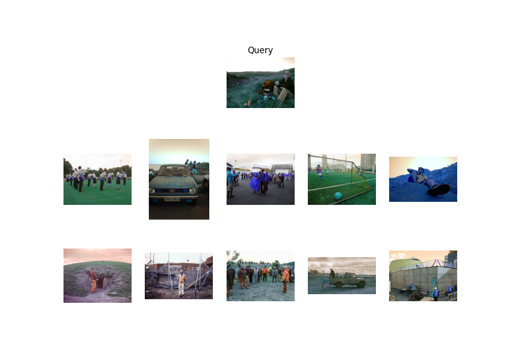
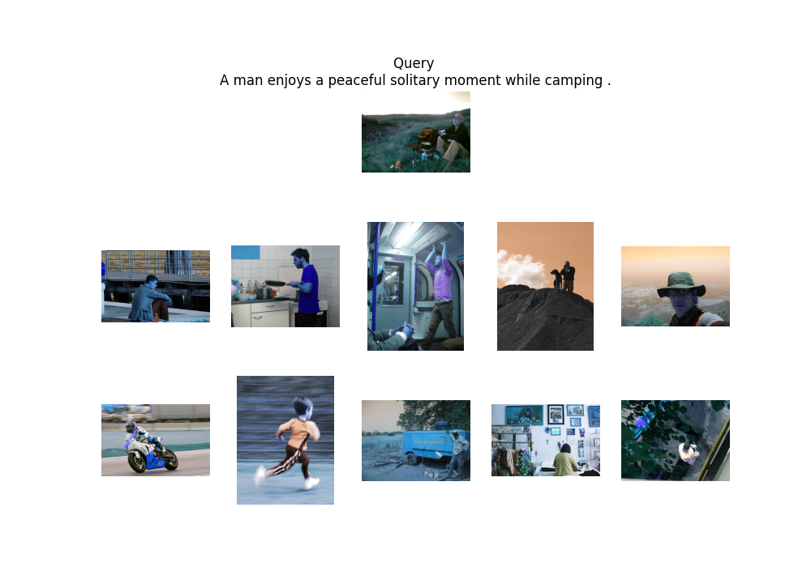

# Flickr Image Study - Kaggle

Showing some examples for image and NLP processing.

# Data

Data taken from https://www.kaggle.com/hsankesara/flickr-image-dataset/download

# Classes

| *Filename* | *Usage* |
| --- | --- |
| `dataset.py` | Class structure to hold data information |
| `image_clustering_knn.py` | Processing to perform k-nearest neighbour algorithm |
| `text_embedding.py` | Processing to generate text embedding space weights |
| `vocab_clustering_knn.py` | Processing to perform knn using word embeddings |
| `utils.py` | Useful utility functions to be loaded and reduce bloat across scripts |
| `embedding.npz` | Text embedding dictionary stored in npz format |

# Usage

With the flickr dataset downloaded and placed in a `data/` folder, these scripts can be run simply with `python3 image_clustering_knn.py`, `python3 text_embedding.py` and `python3 vocab_clustering_knn.py`.

# Tableau

As a small test of using Tableau, the results are also written to a csv file and a subset of images are hosted in this github repository. The URLs are stored in the csv file and a Tableau dashboard has been created using an image viewer extension. The structure is not ideal, but by clicking on the table, it will load the target image and the three top matches.

[Link to published Tableau dashboard](https://public.tableau.com/views/flickr_image_display/Dashboard1?:language=en-GB&:display_count=n&:origin=viz_share_link)

The word embedding can also be visualised in [this public Tableau dashboard](https://public.tableau.com/shared/BZKPX7F4Y?:display_count=n&:origin=viz_share_link) where the embedding is projected across two dimensions and is interactive allowing the user to select different dimensions to explore the patterns. The python object was rewritten to a csv file to allow Tableau to access the data points.

# Results

Running on 990 data points, the clustering results in the following example results. The pixel clustering only required the images to be loaded and normalised for pixel intensity. The text embedding first required an embedding to be trained (here I only used 10 nodes) and these weights are then loaded and summed to give a point in vector space for each caption which is subsequently used for the clustering.

When using pixel information for clustering...

When using text embedding for clustering...

